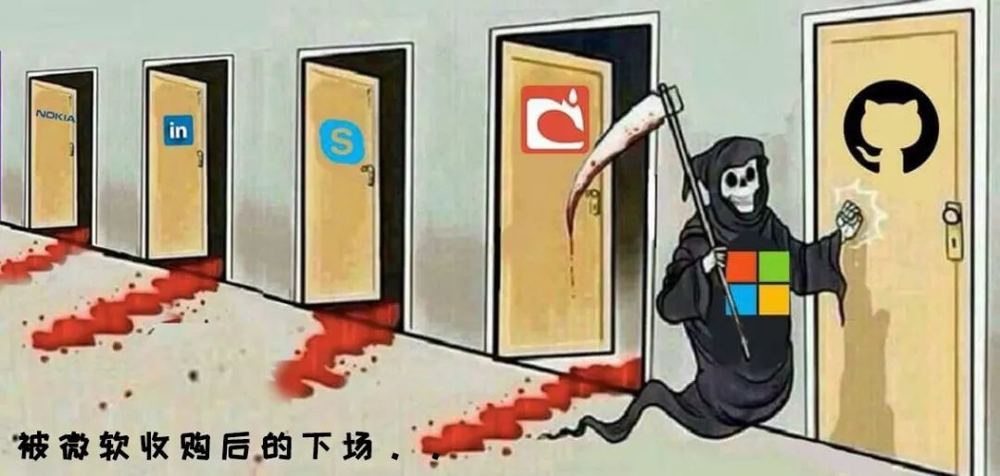

- 我是一个斐波那契程序员
	
	-  我每天都在修前天和昨天写的bug
- 忍一时越想越气，退一步越想越亏
- 测试永远找不到程序爆炸的原因
	```
	昨晚在酒吧玩，忽然：
    一个测试工程师走进酒吧，要了一杯啤酒；
    一个测试工程师走进酒吧，要了一杯咖啡；
    一个测试工程师走进酒吧，要了0.7杯啤酒；
    一个测试工程师走进酒吧，要了-1杯啤酒；
    一个测试工程师走进酒吧，要了2^32杯啤酒；
    一个测试工程师走进酒吧，要了一杯洗脚水；
    一个测试工程师走进酒吧，要了一杯蜥蜴；
    一个测试工程师走进酒吧，要了一份asdfQwer@24dg!&*(@；
    一个测试工程师走进酒吧，什么也没要；
    一个测试工程师走进酒吧，又走出去又从窗户进来又从后门出去从下水道钻进来；
    一个测试工程师走进酒吧，又走出去又进来又出去又进来又出去，最后在外面把老板打了一顿；
    一个测试工程师走进酒吧，要了一杯烫烫烫的锟斤拷；
    一个测试工程师走进酒吧，要了NaN杯Null；
    一个测试工程师冲进酒吧，要了500T啤酒咖啡洗脚水野猫狼牙棒奶茶；
    一个测试工程师把酒吧拆了；
    一个测试工程师化装成老板走进酒吧，要了500杯啤酒并且不付钱；
    一万个测试工程师在酒吧门外呼啸而过；
    一个测试工程师走进酒吧，要了一杯啤酒';DROP TABLE 酒吧；
    测试工程师满意地离开了酒吧。
    我看的肚子都饿了，就喊了句：给我来一份蛋炒饭！
    结果，酒吧炸了！
  ```

- 被微软收购后的下场



- 码农之怒，开源百万