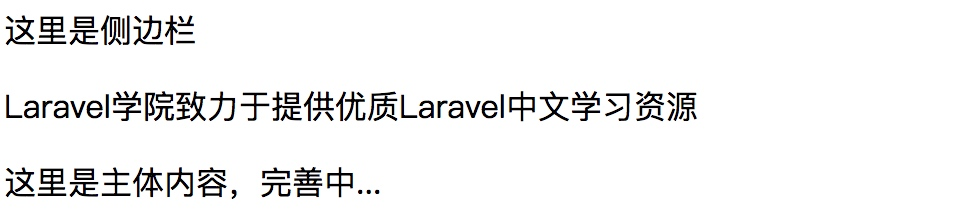

### 简介

Blade 是由 Laravel 提供的非常简单但功能强大的模板引擎，不同于其他流行的 PHP 模板引擎，Blade 在视图中并不约束你使用 PHP 原生代码。所有的 Blade 视图最终都会被编译成原生 PHP 代码并缓存起来直到被修改，这意味着对应用的性能而言 Blade 基本上是零开销。Blade 视图文件使用 `.blade.php` 文件扩展并存放在 `resources/views` 目录下。

### 模板继承

#### 定义布局

使用 Blade 的两个最大优点是模板继承和片段组合，开始之前让我们先看一个例子。首先，我们测试“主”页面布局，由于大多数 Web 应用在不同页面中使用同一个布局，可以很方便的将这个布局定义为一个单独的 Blade 页面：

```php+HTML
<!-- 存放在 resources/views/layouts/app.blade.php -->

<html>
    <head>
        <title>应用名称 - @yield('title')</title>
    </head>
    <body>
        @section('sidebar')
            这里是侧边栏
        @show

        <div class="container">
            @yield('content')
        </div>
    </body>
</html>
```

正如你所看到的，该文件包含典型的 HTML 标记，不过，注意 `@section` 和 `@yield` 指令，前者正如其名字所暗示的，定义了一个内容片段，而后者用于显示给定片段的内容。

现在我们已经为应用定义了一个布局，接下来让我们定义继承该布局的子页面吧。

#### 继承布局

定义子页面的时候，可以使用 Blade 的 `@extends` 指令来指定子页面所继承的布局，继承一个 Blade 布局的视图可以使用 `@section` 指令注入内容到布局定义的内容片段中，记住，如上面例子所示，这些片段的内容将会显示在布局中使用 `@yield` 的地方：

```php
<!-- 存放在 resources/views/child.blade.php -->

@extends('layouts.app')

@section('title', 'Laravel学院')

@section('sidebar')
    @parent
    <p>Laravel学院致力于提供优质Laravel中文学习资源</p>
@endsection

@section('content')
    <p>这里是主体内容，完善中...</p>
@endsection
```

在本例中，`sidebar` 片段使用 `@parent` 指令来追加（而非覆盖）内容到继承布局的侧边栏，`@parent` 指令在视图渲染时将会被布局中的内容替换。

> 注：与之前的示例相反，`sidebar` 部分以 `@endsection` 结束而不是 `@show`，`@endsection` 指令只是定义一个 section 而 `@show` 指令定义并立即返回这个 section。

Blade 视图可以通过 `view` 方法直接从路由中返回：

```php
Route::get('blade', function () {
   return view('child');
});
```

这样在浏览器中访问 `http://blog.test/blade`，就可以看到页面显示如下：



现在页面还很粗糙，没有任何样式，后面学习前端组件后可以回来完善。

#### 组件 & 插槽

组件和插槽给内容片段（section）和布局（layout）带来了方便，不过，有些人可能会发现组件和插槽的模型更容易理解。首先，我们假设有一个可复用的“alert”组件，我们想要在整个应用中都可以复用它：

```php+HTML
<!-- /resources/views/alert.blade.php -->

<div class="alert alert-danger">
    {{ $slot }}
</div>
```

`{{ $slot }}` 变量包含了我们想要注入组件的内容，现在，要构建这个组件，我们可以使用 Blade 指令 `@component`：

```php+HTML
@component('alert')
    <strong>Whoops!</strong> Something went wrong!
@endcomponent
```

有时候为组件定义多个插槽很有用。下面我们来编辑alert组件以便可以注入“标题”，命名插槽可以通过“echoing”与它们的名字相匹配的变量来显示：

```php+HTML
<!-- /resources/views/alert.blade.php -->

<div class="alert alert-danger">
    <div class="alert-title">{{ $title }}</div>
    {{ $slot }}
</div>
```

现在，我们可以使用指令 `@slot` 注入内容到命名的插槽。任何不在 `@slot` 指令中的内容都会被传递到组件的 `$slot` 变量中：

```php+HTML
@component('alert')
    @slot('title')
        Forbidden
    @endslot

    You are not allowed to access this resource!
@endcomponent
```

当我们在浏览器中查看这个组件内容的话，对应输出如下：


这段代码的意思是通过组件名 `alert` 去查找对应的视图文件，装载到当前视图，然后通过组件中 `@slot` 定义的插槽内容去渲染插槽视图中对应的插槽位，如果组件没有为某个插槽位定义对应的插槽内容片段，则组件中的其他不在 `@slot` 片段中的内容将会用于渲染该插槽位，如果没有其他多余内容则对应插槽位为空。

**传递额外数据到组件**

有时候你可能需要传递额外数据到组件，出于这个原因，你可以传递数组数据作为第二个参数到 `@component` 指令，所有数据都会在组件模板中以变量方式生效：

```php+HTML
@component('alert', ['foo' => 'bar'])
    ...
@endcomponent
```

**组件别名**

如果 Blade 组件存储在子目录中，你可能想要给它们起别名以便访问。例如，假设有一个存放在 `resources/views/components/alert.blade.php` 的 Blade 组件，你可以使用 `component` 方法将这个组件设置别名为 `alert`（原名是 `components.alert`）。通常，这个操作在 `AppServiceProvider` 的 `boot` 方法中完成：

```php+HTML
use Illuminate\Support\Facades\Blade;

Blade::component('components.alert', 'alert');
```

组件设置别名后，就可以使用如下指令来渲染：

```php+HTML
@alert(['type' => 'danger'])
    You are not allowed to access this resource!
@endalert
```

如果没有额外插槽的话也可以省略组件参数：

```php+HTML
@alert
    You are not allowed to access this resource!
@endalert
```

### 数据显示

可以通过两个花括号包裹变量来显示传递到视图的数据，比如，如果给出如下路由：

```php+HTML
Route::get('greeting', function () {
    return view('welcome', ['name' => '学院君']);
});
```

那么可以通过如下方式显示 `name` 变量的内容：

```php+HTML
你好, {{ $name }}。
```

当然，不限制显示到视图中的变量内容，你还可以输出任何 PHP 函数的结果，实际上，可以将任何 PHP 代码放到 Blade 模板语句中：

```php+HTML
The current UNIX timestamp is {{ time() }}.
```

> 注：Blade 的 `{{}}` 语句已经经过 PHP 的 `htmlentities` 函数处理以避免 XSS 攻击。

**输出存在的数据**

有时候你想要输出一个变量，但是不确定该变量是否被设置，我们可以通过如下 PHP 代码：

```php+HTML
{{ isset($name) ? $name : 'Default' }}
```

除了使用三元运算符，Blade 还提供了更简单的方式：

```php+HTML
{{ $name or 'Default' }}
```

在本例中，如果 `$name` 变量存在，其值将会显示，否则将会显示 `Default`。

**显示原生数据**

默认情况下，Blade 的 `{{ }}` 语句已经通过 PHP 的 `htmlentities` 函数处理以避免 XSS 攻击，如果你不想要数据被处理，比如要输出带 HTML 元素的富文本，可以使用如下语法：

```php+HTML
Hello, {!! $name !!}.
```

> 注：输出用户提供的内容时要当心，对用户提供的内容总是要使用双花括号包裹以避免直接输出 HTML 代码。

**渲染 JSON 内容**

有时候你可能会将数据以数组方式传递到视图再将其转化为 JSON 格式以便初始化某个 JavaScript 变量，例如：

```javascript
<script>php+HTML
    var app = <?php echo json_encode($array); ?>;
</script>
```

这样显得很麻烦，有更简便的方式来实现这个功能，那就是 Blade 的 `@json` 指令：

```javascript
<script>php+HTML
    var app = @json($array);
</script>
```

**HTML 实体编码**

默认情况下，Blade（以及辅助函数 `e`）会对 HTML 实体进行双重编码。如果你想要禁止双重编码，可以在 `AppServiceProvider` 的 `boot` 方法中调用 `Blade::withoutDoubleEncoding` 方法：

```php
<?php

namespace App\Providers;

use Illuminate\Support\Facades\Blade;
use Illuminate\Support\ServiceProvider;

class AppServiceProvider extends ServiceProvider
{
    /**
     * Bootstrap any application services.
     *
     * @return void
     */
    public function boot()
    {
        Blade::withoutDoubleEncoding();
    }
}
```

#### Blade & JavaScript 框架

由于很多 JavaScript 框架也是用花括号来表示要显示在浏览器中的表达式，如 Vue，我们可以使用 `@` 符号来告诉 Blade 渲染引擎该表达式应该保持原生格式不作改动。比如：

```php+HTML
<h1>Laravel</h1>
Hello, @{{ name }}.
```

在本例中，`@` 符在编译阶段会被 Blade 移除，但是，`{{ name }}` 表达式将会保持不变，从而可以被 JavaScript 框架正常渲染。

**@verbatim指令**

如果你在模板中有很大一部分篇幅显示 JavaScript 变量，那么可以将这部分 HTML 封装在 `@verbatim` 指令中，这样就不需要在每个 Blade 输出表达式前加上 `@` 前缀：

```php+HTML
@verbatim
    <div class="container">
        Hello, {{ name }}.
    </div>
@endverbatim
```

### 流程控制

除了模板继承和数据显示之外，Blade 还为常用的 PHP 流程控制提供了便利操作，例如条件语句和循环，这些快捷操作提供了一个干净、简单的方式来处理 PHP 的流程控制，同时保持和 PHP 相应语句的相似性。

#### If 语句

可以使用 `@if` , `@elseif` , `@else` 和 `@endif` 来构造 `if` 语句，这些指令的功能和 PHP 相同：

```
@if (count($records) === 1)
    I have one record!
@elseif (count($records) > 1)
    I have multiple records!
@else
    I don't have any records!
@endif
```

为方便起见，Blade 还提供了 `@unless` 指令，表示除非：

```
@unless (Auth::check())
    You are not signed in.
@endunless
```

此外，Blade 还提供了 `@isset` 和 `@empty` 指令，分别对应 PHP 的 `isset` 和 `empty` 方法：

```
@isset($records)
    // $records is defined and is not null...
@endisset

@empty($records)
    // $records is "empty"...
@endempty
```

**认证指令**

`@auth` 和 `@guest` 指令可用于快速判断当前用户是否登录：

```
@auth
    // 用户已登录...
@endauth

@guest
    // 用户未登录...
@endguest
```

如果需要的话，你也可以在使用 `@auth` 和 `@guest` 的时候指定[认证 guard](http://laravelacademy.org/post/8270.html)：

```
@auth('admin')
    // The user is authenticated...
@endauth

@guest('admin')
    // The user is not authenticated...
@endguest
```

**Section 指令**

你可以使用 `@hasSection` 指令判断某个 section 中是否有内容：

```
@hasSection('navigation')
    <div class="pull-right">
        @yield('navigation')
    </div>

    <div class="clearfix"></div>
@endif
```

#### Switch 语句

`switch` 语句可以通过 `@switch`，`@case`，`@break`，`@default` 和 `@enswitch` 指令构建：

```
@switch($i)
    @case(1)
        First case...
        @break

    @case(2)
        Second case...
        @break

    @default
        Default case...
@endswitch
```

#### 循环

除了条件语句，Blade 还提供了简单的指令用于处理 PHP 的循环结构，同样，这些指令的功能和 PHP 对应功能完全一样：

```
@for ($i = 0; $i < 10; $i++)
    The current value is {{ $i }}
@endfor

@foreach ($users as $user)
    <p>This is user {{ $user->id }}</p>
@endforeach

@forelse ($users as $user)
    <li>{{ $user->name }}</li>
@empty
    <p>No users</p>
@endforelse

@while (true)
    <p>I'm looping forever.</p>
@endwhile
```

> 注：在循环的时候可以使用 `$loop` 变量获取循环信息，例如是否是循环的第一个或最后一个迭代。javascript

使用循环的时候还可以结束循环或跳出当前迭代：

```
@foreach ($users as $user)
    @if ($user->type == 1)
        @continue
    @endif

    <li>{{ $user->name }}</li>

    @if ($user->number == 5)javascript
        @break
    @endif
@endforeach
```

还可以使用指令声明来引入条件：

```
@foreach ($users as $user)
    @continue($user->type == 1)
        <li>{{ $user->name }}</li>
    @break($user->number == 5)
@endforeach
```

#### `$loop`变量

在循环的时候，可以在循环体中使用 `$loop` 变量，该变量提供了一些有用的信息，比如当前循环索引，以及当前循环是不是第一个或最后一个迭代：

```
@foreach ($users as $user)
    @if ($loop->first)
        This is the first iteration.
    @endif

    @if ($loop->last)
        This is the last iteration.
    @endif

    <p>This is user {{ $user->id }}</p>
@endforeach
```

如果你身处嵌套循环，可以通过 `$loop` 变量的 `parent` 属性访问父级循环：

```
@foreach ($users as $user)
    @foreach ($user->posts as $post)
        @if ($loop->parent->first)
            This is first iteration of the parent loop.
        @endif
    @endforeach
@endforeach
```

`$loop` 变量还提供了其他一些有用的属性：

| 属性               | 描述                         |
| :----------------- | :--------------------------- |
| `$loop->index`     | 当前循环迭代索引 (从0开始)   |
| `$loop->iteration` | 当前循环迭代 (从1开始)       |
| `$loop->remaining` | 当前循环剩余的迭代           |
| `$loop->count`     | 迭代数组元素的总数量         |
| `$loop->first`     | 是否是当前循环的第一个迭代   |
| `$loop->last`      | 是否是当前循环的最后一个迭代 |
| `$loop->depth`     | 当前循环的嵌套层级           |
| `$loop->parent`    | 嵌套循环中的父级循环变量     |

#### 注释

Blade 还允许你在视图中定义注释，然而，不同于 HTML 注释，Blade 注释并不会包含到 HTML 中被返回：

```
{{-- This comment will not be present in the rendered HTML --}}
```

#### PHP

在一些场景中，嵌入 PHP 代码到视图中很有用，你可以使用 `@php` 指令在模板中执行一段原生 PHP 代码：

```
@php
    //
@endphp
```

> 注：尽管 Blade 提供了这个特性，如果过于频繁地使用它意味着你在视图模板中嵌入了过多的业务逻辑，需要注意。

### 包含子视图

Blade 的 `@include` 指令允许你很轻松地在一个视图中包含另一个 Blade 视图，所有父级视图中变量在被包含的子视图中依然有效：

```
<div>
    @include('shared.errors')

    <form>
        <!-- Form Contents -->
    </form>
</div>
```

上述指令会在当前目录下的 `shared` 子目录中寻找 `errors.blade.php` 文件并将其内容引入当前视图。

尽管被包含的视图可以继承所有父视图中的数据，你还可以传递额外参数到被包含的视图：

```
@include('view.name', ['some' => 'data'])
```

当然，如果你尝试包含一个不存在的视图，Laravel 会抛出错误，如果你想要包含一个有可能不存在的视图，可以使用 `@includeIf` 指令：

```
@includeIf('view.name', ['some' => 'data'])
```

如果包含的视图取决于一个给定的布尔条件，可以使用 `@includeWhen` 指令：

```
@includeWhen($boolean, 'view.name', ['some' => 'data'])
```

要包含给定数组中的第一个视图，可以使用 `@includeFirst` 指令：

```
@includeFirst(['custom.admin', 'admin'], ['some' => 'data'])
```

> 注：不要在 Blade 视图中使用 `__DIR__` 和 `__FILE__` 常量，因为它们会指向缓存视图的路径。

曾经有人问过我 `@include` 和 `@component` 有什么区别，两者有共同之处，都用于将其他内容引入当前视图，我理解的区别在于 `@include` 用于粗粒度的视图包含，`@component` 用于细粒度的组件引入，`@component` 通过插槽机制对引入视图内容可以进行更加细粒度的控制，如果你只是引入一块视图内容片段，用 `@include` 即可，如果想要在当前视图对引入视图内容片段进行调整和控制，则可以考虑使用 `@component`。

#### 渲染集合视图

你可以使用 Blade 的 `@each` 指令通过一行代码循环引入多个局部视图：

```
@each('view.name', $jobs, 'job')
```

该指令的第一个参数是数组或集合中每个元素要渲染的局部视图，第二个参数是你希望迭代的数组或集合，第三个参数是要分配给当前视图的变量名。举个例子，如果你要迭代一个 `jobs` 数组，通常你需要在局部视图中访问 `$job` 变量。在局部视图中可以通过 `key` 变量访问当前迭代的键。

你还可以传递第四个参数到 `@each` 指令，该参数用于指定给定数组为空时渲染的视图：

```
@each('view.name', $jobs, 'job', 'view.empty')
```

> 注：通过 `@each` 渲染的视图不会从父视图中继承变量，如果子视图需要这个变量，可以使用 `@foreach` 和 `@include` 指令来替代。

### 堆栈

Blade 允许你推送内容到命名堆栈，以便在其他视图或布局中渲染。这在子视图中引入指定 JavaScript 库时很有用：

```
@push('scripts')
    <script src="/example.js"></script>
@endpush
```

推送次数不限，要渲染完整的堆栈内容，传递堆栈名称到 `@stack` 指令即可：

```
<head>
    <!-- Head Contents -->

    @stack('scripts')
</head>
```

### 服务注入

`@inject` 指令可以用于从服务容器中获取服务，传递给 `@inject` 的第一个参数是服务对应的变量名，第二个参数是要解析的服务类名或接口名：

```
@inject('metrics', 'App\Services\MetricsService')

<div>
    Monthly Revenue: {{ $metrics->monthlyRevenue() }}.
</div>
```

### 扩展 Blade

Blade 甚至还允许你自定义指令，可以使用 `directive` 方法来注册一个指令。当 Blade 编译器遇到该指令，将会传入参数并调用提供的回调。

下面的例子创建了一个 `@datetime($var)` 指令格式化给定的 `DateTime` 的实例 `$var`：

```
<?php

namespace App\Providers;

use Illuminate\Support\Facades\Blade;
use Illuminate\Support\ServiceProvider;

class AppServiceProvider extends ServiceProvider
{
    /**
     * Perform post-registration booting of services.
     *
     * @return void
     */
    public function boot()
    {
        \Blade::directive('datetime', function($expression) {
            return "<?php echo ($expression)->format('m/d/Y H:i'); ?>";
        });
    }

    /**
     * 在容器中注册绑定.
     *
     * @return void
     */
    public function register()
    {
        //
    }
}
```

正如你所看到的，我们可以将 `format` 方法应用到任何传入指令的表达式上，所以，在本例中，该指令最终生成的 PHP 代码如下：

```
<?php echo ($var)->format('m/d/Y H:i'); ?>
```

> 注：更新完 Blade 指令逻辑后，必须删除所有的 Blade 缓存视图。缓存的 Blade 视图可以通过 Artisan 命令 `view:clear` 移除。

#### 自定义 If 语句

在定义一些简单、自定义的条件语句时，编写自定义指令往往复杂性大于必要性，因为这个原因，Blade 提供了一个 `Blade::if` 方法通过闭包的方式快速定义自定义的条件指令，例如，我们来自定义一个条件来检查当前应用的环境，我们可以在 `AppServiceProvider` 的 `boot` 方法中定义这段逻辑：

```php
use Illuminate\Support\Facades\Blade;

/**
 * Perform post-registration booting of services.
 *
 * @return void
 */
public function boot()
{
    \Blade::if('env', function ($environment) {
        return app()->environment($environment);
    });
}
```

定义好自定义条件后，就可以在模板中使用了：

```php
@env('local')
    // The application is in the local environment...
@elseenv('testing')
    // The application is in the testing environment...
@else
    // The application is not in the local or testing environment...
@endenv
```